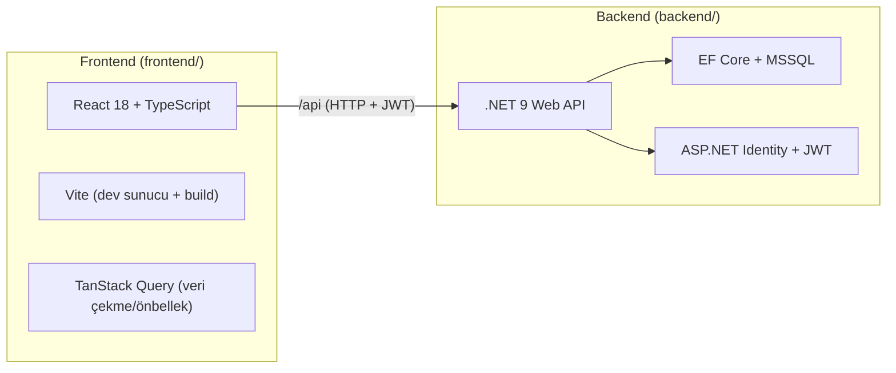

# 00 — Projeye Genel Bakış

## İK Pro nedir?

İK Pro, insan kaynakları (İK) operasyonlarını tek yerden yöneten **çok müşterili
(multi-tenant) bir SaaS uygulamasıdır**. Her müşteri şirket kendi verisiyle
izole çalışır; personel, izin, bordro, işe alım, uyum ve risk analizi gibi
modülleri içerir.

Üç kullanıcı rolü vardır:

| Rol | Kim | Ne görür |
| --- | --- | --- |
| `hr-admin` | İK yöneticisi | Her şey — tüm şirket verisi, ayarlar, işe alım, bordro |
| `manager` | Departman yöneticisi | Yalnız **kendi ekibi** (izin onayı, ekip riski, puantaj) |
| `employee` | Çalışan | Yalnız **kendisi** (kendi izinleri, bordro pusulası, profili) |

Bu rol matrisi hem backend policy'lerinde hem frontend route'larında birebir uygulanır.

## Teknoloji Yığını



- **Frontend:** React 18, TypeScript, Vite, TanStack Query. API tipleri backend
  Swagger'ından **otomatik üretilir** (`npm run gen:api`) — elle tip yazmayız.
- **Backend:** .NET 9, Clean Architecture, EF Core (MSSQL), MediatR (CQRS),
  FluentValidation, ASP.NET Identity + JWT (refresh rotasyonlu), Serilog, QuestPDF
  (bordro pusulası PDF), MailKit (SMTP e-posta).
- **Veritabanı:** Microsoft SQL Server (LocalDB/SQL Express geliştirmede yeter).

## Büyük Resim: Katmanlar

Backend, **Clean Architecture** ile dört katmana ayrılır (detay: [02](02-mimari-clean-architecture.md)):

```
IKPro.Domain          → İş varlıkları ve kuralları (bağımlılık yok)
IKPro.Application     → Kullanım senaryoları (CQRS handler'lar, doğrulama)
IKPro.Infrastructure → Dış dünya (EF Core, Identity, dosya, e-posta)
IKPro.API            → HTTP uçları (controller'lar, kimlik doğrulama)
```

Temel kural: **bağımlılık içe doğru akar.** Domain hiçbir şeye bağlı değildir;
API en dıştadır. Bu sayede iş mantığı, veritabanı/framework değişiklerinden
korunur ve kolay test edilir.

## Depo Yapısı

| Klasör | İçerik |
| --- | --- |
| `backend/` | .NET 9 API (Clean Architecture) |
| `frontend/` | React + TypeScript arayüz |
| `legacy-frontend/` | Orijinal mock prototip — **değiştirilmez**, piksel-parite referansı |
| `docs/` | Bu rehberler, geliştirme günlüğü, KVKK dokümanı, planlar |
| `raporlar/` | Backend faz planı |

## Öne Çıkan Yetenekler

- **Çok kiracılılık:** Ortak veritabanı + `TenantId` + otomatik global filtre;
  bir kiracı asla başka kiracının verisini göremez ([06](06-multi-tenancy.md)).
- **Self-servis kayıt:** Müşteri kendi şirketini public formdan oluşturur, davet
  e-postasıyla hesabını etkinleştirir.
- **KVKK araçları:** Kendi verini dışa aktarma (`/api/me/data-export`), kiracı
  verisini kalıcı silme (purge), doğrulanmamış kiracı temizliği.
- **Modüller:** Risk Merkezi, Personel, İşe Alım (ATS), İzin/Onay, Puantaj,
  Bordro (pusula PDF'i dahil), Uyum & Belge, Yönetici Konsolu, Ctrl+K arama.

## Sonraki Adım

Uygulamayı bilgisayarında çalıştırmak için → [01 — Ortam Kurulumu](01-ortam-kurulumu.md).
