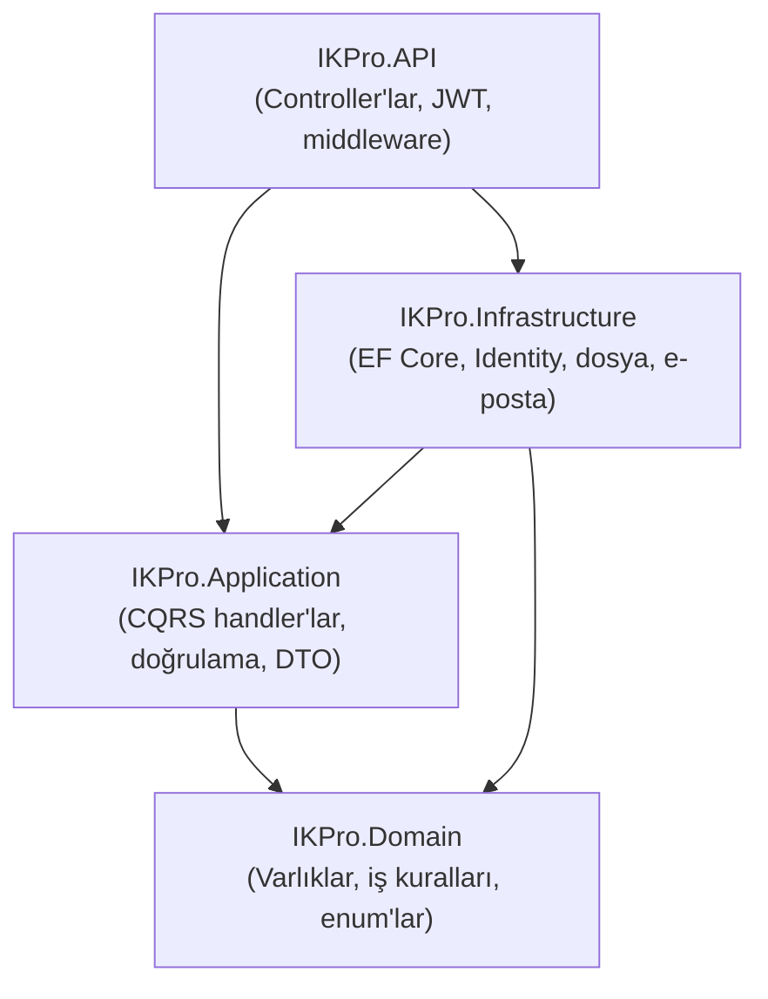
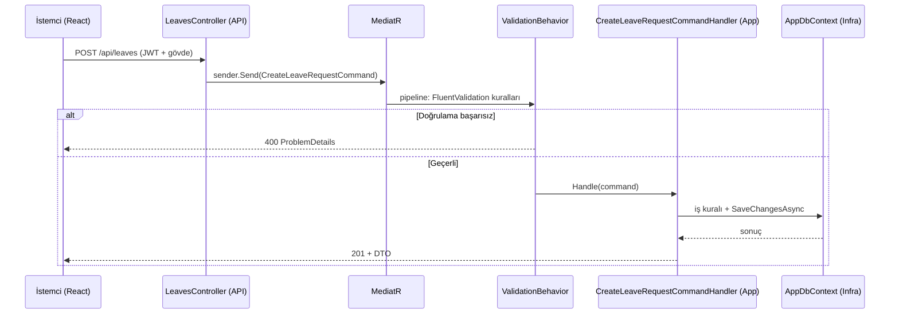

# 02 — Mimari: Clean Architecture

Backend, **Clean Architecture** ile tasarlanmıştır. Bu rehber katmanları, aralarındaki
kuralı ve bir HTTP isteğinin baştan sona yolculuğunu açıklar.

## Dört Katman



| Katman | Sorumluluk | Neye bağımlı |
| --- | --- | --- |
| **Domain** | İş varlıkları (`Employee`, `LeaveRequest`…), enum'lar, saf iş kuralları | **Hiçbir şeye** (çekirdek) |
| **Application** | Kullanım senaryoları: komut/sorgu handler'ları, doğrulama, arayüzler (`IApplicationDbContext`, `IEmailSender`…) | Domain |
| **Infrastructure** | Arayüzlerin gerçek uygulaması: EF Core `AppDbContext`, Identity, `LocalFileStorage`, SMTP | Application + Domain |
| **API** | HTTP uçları, kimlik doğrulama, yetki, hata yakalama, DI birleştirme | Application + Infrastructure |

## Bağımlılık Kuralı (en önemli fikir)

**Bağımlılık her zaman içe (Domain'e) doğru akar.** Domain hiçbir dış şeyi bilmez;
Application yalnız Domain'i bilir. Application, veritabanına doğrudan bağlı olmak
yerine bir **arayüze** (`IApplicationDbContext`) bağlıdır; bu arayüzün EF Core'lu
gerçek uygulaması Infrastructure'dadır ve çalışma zamanında DI ile enjekte edilir.

**Neden?** İş mantığı (Application/Domain) framework ve veritabanı seçimlerinden
yalıtılır. Böylece:
- İş kurallarını gerçek DB olmadan test edebiliriz.
- Veritabanı/kütüphane değişse iş mantığı bozulmaz.
- Her katmanın tek bir net sorumluluğu olur.

## Bir İsteğin Yolculuğu

Örnek: bir çalışan izin talebi oluşturuyor (`POST /api/leaves`).



Adımlar:
1. **Controller** yalnız komutu/sorguyu MediatR'a iletir — iş mantığı içermez (ince controller).
2. **ValidationBehavior** (MediatR pipeline'ı) FluentValidation kurallarını otomatik çalıştırır; başarısızsa `ValidationException` → global handler 400 döner.
3. **Handler** asıl işi yapar: iş kuralı, veritabanı, sonuç.
4. Hatalar merkezi `GlobalExceptionHandler`'da `ProblemDetails`'a çevrilir (standart hata formatı).

## CQRS Nedir? (Command/Query ayrımı)

Her işlem ya **Command** (veri değiştirir) ya **Query** (veri okur) olarak modellenir.
Her ikisi de MediatR üzerinden akar. Bir özellik tipik olarak tek dosyada üç şey içerir:

```csharp
// 1) Komut/sorgu (girdi) — record
public sealed record ProvisionTenantCommand(string CompanyName, string Slug, ...) : IRequest<ProvisionTenantResult>;

// 2) Doğrulayıcı — FluentValidation
public sealed class ProvisionTenantCommandValidator : AbstractValidator<ProvisionTenantCommand> { ... }

// 3) Handler — asıl iş
public sealed class ProvisionTenantCommandHandler : IRequestHandler<ProvisionTenantCommand, ProvisionTenantResult> { ... }
```

Bu üçlü kalıbı projede her yerde görürsün (bkz. gerçek örnek:
`backend/src/IKPro.Application/Features/Tenancy/Commands/ProvisionTenantCommand.cs`).

## Nereye Ne Koyulur?

| Eklemek istediğin | Katman | Örnek klasör |
| --- | --- | --- |
| Yeni bir tablo/varlık | Domain | `IKPro.Domain/Entities/...` |
| Yeni bir iş işlemi (uç) | Application | `IKPro.Application/Features/<Modül>/...` |
| Yeni bir dış entegrasyon | Infrastructure | `IKPro.Infrastructure/...` |
| Yeni bir HTTP ucu | API | `IKPro.API/Controllers/...` |

## Sonraki Adım

Backend'in içine girelim → [03 — Backend Derinlemesine](03-backend-derinlemesine.md).
