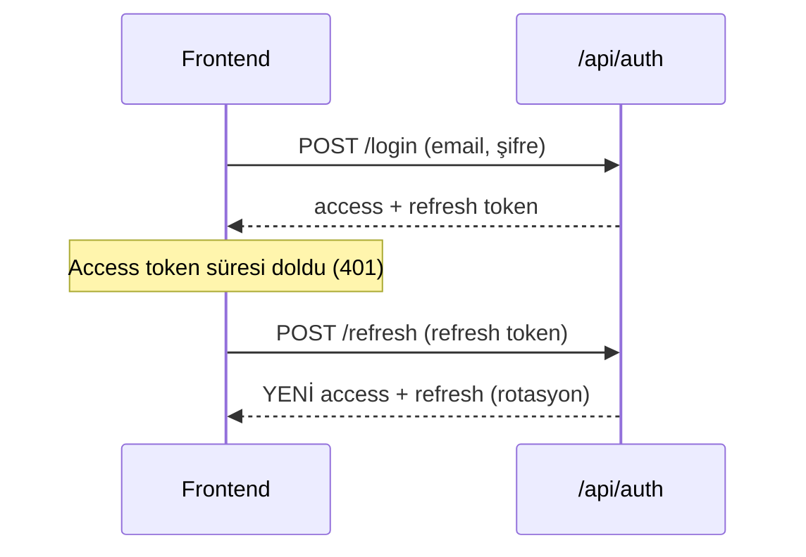
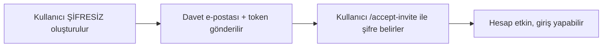

# 05 — Kimlik & Yetkilendirme

Kullanıcı nasıl giriş yapar, oturum nasıl korunur, roller nasıl uygulanır ve yeni
kullanıcılar nasıl güvenli kurulur — hepsi burada.

## JWT + Refresh Token

Giriş başarılı olunca backend iki token üretir:

- **Access token (JWT):** Kısa ömürlü (varsayılan 60 dk). Her istekte
  `Authorization: Bearer <token>` başlığında gider. İçinde **claim'ler** taşır:
  `sub` (kullanıcı id), `name`, `email`, `role`, `employeeId`, **`tenant`** (kiracı id).
- **Refresh token:** Uzun ömürlü (varsayılan 7 gün). Access token süresi dolunca
  yenisini almak için kullanılır. DB'de **hash'lenmiş** saklanır.



**Refresh rotasyonu:** Her refresh'te eski refresh token iptal edilir ve yeni bir
çift üretilir. Çalınmış bir refresh token'ın tekrar kullanımını sınırlar. Bu mantık
frontend'de `api/client.ts` (tek-uçuş refresh), backend'de `IdentityService`'tedir.

## Roller ve Policy'ler

Üç rol: `hr-admin`, `manager`, `employee`. Backend'de policy'lerle uygulanır
(`Program.cs` + `Policies` sabitleri):

```csharp
[Authorize(Policy = Policies.HrAdminOnly)]   // yalnız hr-admin
[Authorize(Policy = Policies.Management)]     // hr-admin + manager
[Authorize(Policy = Policies.PayrollAccess)]  // hr-admin + employee
```

Ek olarak **kapsam daraltma** vardır: bir `manager` yalnız kendi ekibini, bir
`employee` yalnız kendini görür. Bu, handler'larda `ICurrentUser.EmployeeId` ile
sorguları filtreleyerek yapılır (ör. `GetTeamLeavesQuery` yöneticinin ekibiyle sınırlar).

> **Kural:** Yetki iki katmanlıdır — (1) policy rolü kontrol eder, (2) sorgu kapsamı
> kullanıcının görebileceği satırları daraltır. İkisi birlikte "yatay yetki yükseltme"yi
> (başka çalışanın verisini görme) engeller.

## Güvenli Kullanıcı Kurulumu: Davet Akışı

Yeni kullanıcılar **paylaşılan geçici şifre almaz.** Bunun yerine:



Bu akış iki yerde tetiklenir:
- **Kiracı provizyonu / self-servis kayıt:** ilk `hr-admin` şifresiz oluşur, davet alır.
- **İşe alım (hire):** aday `employee`'ye dönüşünce şifresiz login + davet alır.

**Uçlar:**
- `POST /api/auth/accept-invite` — davet token'ıyla ilk şifreyi belirler (anonim).
- Token geçersiz/süresi geçmişse reddedilir.
- Frontend sayfası: `/#/accept-invite?email=...&token=...` (`AcceptInvitePage.tsx`).

Davet e-postaları `Email:Mode` ayarına göre gider: `outbox` (dev — dosyaya yazar)
veya `smtp` (üretim — MailKit). Detay: [06](06-multi-tenancy.md) ve KVKK dokümanı.

## Kayıt Uçları — Kim Ne Yapar?

| Uç | Kim çağırır | Sonuç |
| --- | --- | --- |
| `POST /api/tenants` | Platform (X-Platform-Key) | Yeni kiracı + ilk hr-admin (provizyon) |
| `POST /api/tenants/signup` | Anonim (public) | Self-servis: **yeni şirket** + hr-admin (`Provisioning`; davet kabul edilince `Active`) |
| `POST /api/auth/accept-invite` | Davetli kullanıcı (token'la) | Şifre belirler, hesabı etkinleştirir |

**Mevcut bir şirkete katılmanın tek yolu davettir.** Personel, işe alım akışıyla
(aday → personel) oluşturulur ve davet e-postası alır; kendi kendine kaydolamaz.

> **⚠️ `POST /api/auth/register` KALDIRILDI — yeniden eklemeyin.**
>
> Bu uç anonimdi ve her yeni kullanıcıyı **platformdaki en düşük Id'li kiracıya**
> (üretimde gerçek bir müşteriye) bağlıyor, `EmailConfirmed=true` yapıyor ve
> token'ı erişim kapısını **bilinçli atlayarak** üretiyordu. Sonuç: internetten
> herhangi biri kaydolup o müşterinin İK verisini okuyabiliyordu — personel
> sayısı, bekleyen izinler, izindekiler, aday hunisi, `/api/me`,
> `/api/payroll/my`, `/api/leaves/*`.
>
> Bu belgede daha önce yer alan "rolü daima `employee` atıyoruz, o yüzden
> güvenli" notu **yanlıştı**: sorun yetki yükseltmesi değil, **yanlış kiracıya
> bağlanmaktı.**
>
> `AuthFlowTests` içinde bu ucun 404 döndüğünü doğrulayan bir regresyon testi var.

## Sonraki Adım

Kiracı izolasyonunun tamamı → [06 — Multi-Tenancy](06-multi-tenancy.md).
