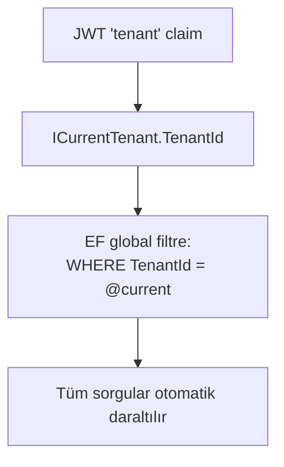

# 06 — Multi-Tenancy (Çok Kiracılılık)

İK Pro çok müşterili bir SaaS'tır: birçok şirket (kiracı) aynı uygulamayı ve aynı
veritabanını paylaşır ama **hiçbiri diğerinin verisini göremez.** Bu rehber bu
izolasyonun nasıl sağlandığını anlatır. (Uyum/KVKK detayı: [`../kvkk-veri-izolasyonu.md`](../kvkk-veri-izolasyonu.md).)

## İzolasyon Modeli: Ortak DB + `TenantId`

Her kiracıya ayrı veritabanı vermek yerine **tek veritabanı, tek şema** kullanılır;
her satır bir `TenantId` sütunuyla sahibine bağlanır.

**Neden bu model?** MVP ölçeğinde basitlik (tek migration, tek yedek), maliyet ve
hız. Mimari, ileride kritik müşteriyi ayrı DB'ye taşımaya kapalı değildir
(`ICurrentTenant` soyutlaması bunu mümkün kılar).

## Çekirdek Garanti: Global Sorgu Filtresi

> EF Core, kiracı-kapsamlı **her** varlığa otomatik olarak `WHERE TenantId = @current`
> ekler. Uygulama kodu bu filtreyi elle yazmaz — dolayısıyla "filtre eklemeyi unutma"
> sızıntısı **yapısal olarak imkânsızdır.**

Nasıl çalışır:
1. `ITenantScoped` arayüzü (`int TenantId { get; set; }`) izolasyona tabi tipleri işaretler.
   `BaseEntity` bunu uygular → ondan türeyen her varlık otomatik dahil olur.
2. `AppDbContext`, model kurulumunda **reflection** ile `ITenantScoped` uygulayan her
   tipi bulur ve her birine `HasQueryFilter(e => e.TenantId == CurrentTenantId)` uygular.
3. Aktif kiracı `ICurrentTenant.TenantId`'den gelir; HTTP isteğinde JWT `tenant` claim'inden okunur.
4. Yeni kayıtlar `AuditableEntityInterceptor` tarafından kaydetme anında otomatik
   `TenantId` ile damgalanır — elle set etmeye gerek yok.

## Katman Katman İzolasyon

İzolasyon yalnız EF varlıklarında değil, **veriye erişen her yolda** uygulanır:

| Katman | Nasıl |
| --- | --- |
| Yazılabilir varlıklar | `BaseEntity : ITenantScoped` + global filtre |
| SQL view / okuma modelleri | View'ler `TenantId` sütununu kendileri taşır (EF filtresini baypas eder) |
| SQL fonksiyonu | `fn_WorkingDays(@start, @end, @tenantId)` — kiracı parametresi zorunlu |
| Audit trigger'ları | Etkilenen satırın `TenantId`'sini kopyalar |
| Dosya/blob | Erişim, tenant-kapsamlı DB satırından geçer → yabancı kiracı 404 alır |
| Kimlik | `ApplicationUser.TenantId`; pasif kiracıya giriş reddedilir |

Bu izolasyon **testlerle kanıtlanır** (`tests/.../Tenancy/`): Kiracı A asla Kiracı B'nin
verisini göremez. Bu, ürünün en kritik güvencesidir.

## `Impersonate` Ne İşe Yarar?

HTTP isteği olmayan bağlamlarda (seed, arka plan servisi, purge) JWT yoktur.
`ICurrentTenant.Impersonate(tenantId)` aktif kiracıyı elle ayarlar; böylece global
filtre bu bağlamda da doğru çalışır. Örnek: `TenantPurger` bir kiracıyı silerken
o kiracıyı impersone eder.

## Kiracı Nasıl Oluşur?

İki yol var:

1. **Provizyon (platform):** `POST /api/tenants` — `X-Platform-Key` başlığıyla
   korunur (normal rol sisteminin dışında, platform operasyonu). Kiracı **aktif** başlar.
2. **Self-servis kayıt (public):** `POST /api/tenants/signup` — platform anahtarı
   gerekmez, ayrı `signup` rate-limit'iyle korunur. Slug (kısa ad) sunucuda şirket
   adından türetilir. Kiracı **pasif** başlar; ilk admin davet e-postasını kabul
   edince (`accept-invite`) **etkinleşir** — yani e-posta doğrulaması kapısı.

## Kiracı Verisini Silme (KVKK)

- `DELETE /api/tenants/{id}?confirmSlug=` — kiracının **tüm** verisini kalıcı siler
  (platform-key + slug onayı gerekir). `ITenantPurger`, silinecek tabloları EF
  metadata'sından türetir ve FK-güvenli sırada tek transaction'da siler.
- `POST /api/tenants/cleanup-unverified` + arka plan servisi — hiç etkinleşmemiş
  eski self-servis kiracıları temizler (varsayılan kapalı, opt-in).

## Yeni Bir Tablo Eklerken Dikkat

- Varlığın `BaseEntity`'den türediğinden emin ol → global filtre + `TenantId` otomatik gelir.
- Yeni bir **SQL view/fonksiyon/trigger** eklersen `TenantId`'yi **elle** taşımalısın
  (EF filtresi bunları kapsamaz).
- Yeni modül için bir **izolasyon testi** ekle (Kiracı A, Kiracı B'yi görmesin).

## Sonraki Adım

Veritabanı ve migration'lar → [07 — Veritabanı & Migration'lar](07-veritabani-ve-migrationlar.md).
