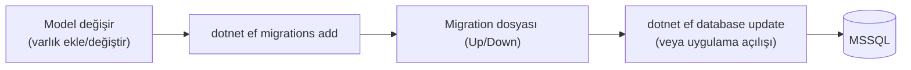

# 07 — Veritabanı & Migration'lar

Veritabanı şeması **EF Core Code-First migration'ları** ile yönetilir: C# model
değişir → migration üretilir → veritabanına uygulanır.

## Genel Akış



- Migration'lar: `backend/src/IKPro.Infrastructure/Persistence/Migrations/`
- Her migration zaman damgalı: `20260717114308_MultiTenancyFoundation.cs`
- `AppDbContextInitializer`:
  - `InitialiseAsync()` → `context.Database.MigrateAsync()` (bekleyen migration'ları uygular)
  - `SeedAsync()` → varsayılan kiracı + demo kullanıcılar + örnek veri

**Development'ta bunlar otomatik** çalışır (`Program.cs`). Üretimde ise migration'lar
**bilinçli bir adımda** uygulanmalıdır (bkz. aşağıdaki uyarı).

## Yeni Migration Ekleme

Bir varlık ekledin/değiştirdin diyelim:

```bash
cd backend
# 1) Migration üret (Infrastructure projesi, başlangıç projesi API)
dotnet ef migrations add AçıklayıcıBirİsim \
  --project src/IKPro.Infrastructure \
  --startup-project src/IKPro.API

# 2) Veritabanına uygula (ya da uygulamayı Development'ta çalıştır)
dotnet ef database update \
  --project src/IKPro.Infrastructure \
  --startup-project src/IKPro.API
```

> `dotnet ef` kurulu değilse: `dotnet tool install --global dotnet-ef`

**İsimlendirme:** Migration adı ne yaptığını anlatmalı (`AddEmployeePhoto`,
`MultiTenancyFoundation` gibi) — tarih otomatik eklenir.

## SQL View / Fonksiyon / Trigger

Bazı raporlar performans için ham SQL nesneleridir (view/fonksiyon). Bunlar EF ile
değil, migration içinde **`migrationBuilder.Sql("CREATE VIEW ...")`** ile yönetilir.
Örnekler: `LeaveSqlObjects`, `PayrollSummaryView`, `ComplianceReadinessView`.

> **Çok önemli (çok kiracılılık):** View'ler ve fonksiyonlar EF global filtresini
> **baypas eder**. Bu yüzden bir view yazarken `TenantId` sütununu mutlaka taşımalı,
> `fn_WorkingDays` gibi fonksiyonlar `@tenantId` parametresi almalıdır. Yeni bir
> SQL nesnesi eklerken bunu unutma (bkz. [06](06-multi-tenancy.md)).

## Seed (Örnek Veri)

`AppDbContextInitializer` şunları oluşturur:
- **Varsayılan kiracı** ("Demo Şirket") + demo departman/personel/izin/bordro verisi.
- **Demo kullanıcılar** (`ik@`, `ece.arslan@`, `ahmet.yilmaz@` — hepsi `demo123`).
- İkinci bir demo kiracı (Globex) — izolasyonu göstermek için.

Seed, `Impersonate` kullanarak varsayılan kiracı bağlamında yazar (JWT yokken bile
global filtre doğru çalışsın diye).

## Test Veritabanı

Entegrasyon testleri ayrı bir `IKProDb_Test` veritabanı kullanır ve **her koşuda
sıfırlar** (`IKProApiFactory`). Böylece testler birbirinden ve gerçek veriden yalıtılır.

## Üretim Uyarısı (satışa hazırlık)

`Program.cs` migration'ı yalnız Development'ta otomatik uygular. Üretim dağıtımında
migration'ları elle veya bir dağıtım adımıyla uygulaman gerekir:

```bash
dotnet ef database update --project src/IKPro.Infrastructure --startup-project src/IKPro.API --connection "<prod-connection>"
```

Ayrıca prod'da bağlantı dizesi ve sırlar **ortam değişkeninden** gelmelidir
(`ConnectionStrings__DefaultConnection`, `Jwt__Secret` vb.); commit'li placeholder'lar prod'da reddedilir.

## Sonraki Adım

Testler → [08 — Testler](08-testler.md).
