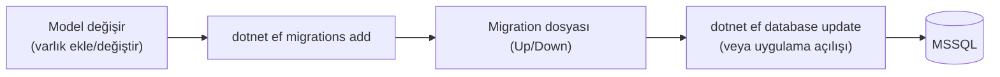

# 07 — Veritabanı & Migration'lar

Veritabanı şeması **EF Core Code-First migration'ları** ile yönetilir: C# model
değişir → migration üretilir → veritabanına uygulanır.

## Genel Akış



- Migration'lar: `backend/src/IKPro.Infrastructure/Persistence/Migrations/`
- Her migration zaman damgalı: `20260717114308_MultiTenancyFoundation.cs`
- `AppDbContextInitializer`:
  - `InitialiseAsync()` → `context.Database.MigrateAsync()` (bekleyen migration'ları uygular)
  - `SeedAsync()` → varsayılan kiracı + demo kullanıcılar + örnek veri

**Development'ta bunlar otomatik** çalışır (`Program.cs`). Üretimde ise migration'lar
**bilinçli bir adımda** uygulanmalıdır (bkz. aşağıdaki uyarı).

## Yeni Migration Ekleme

> **Ekim 2026 itibarıyla iki `DbContext` var** (`AppDbContext` → `IKProDb`,
> `PlatformDbContext` → `IKProPlatform`, bkz. [06](06-multi-tenancy.md)). `dotnet ef`
> hangi context olduğunu tek başına çıkaramaz ve **"More than one DbContext was
> found... Specify which one to use."** hatası verir — her komuta `--context
> AppDbContext` ya da `--context PlatformDbContext` eklemek ZORUNLUDUR. Aşağıdaki
> örnekler bunu doğrulanmış haliyle gösteriyor.

Bir varlık ekledin/değiştirdin diyelim (örnek `AppDbContext` için — kiracı verisi):

```bash
cd backend
# 1) Migration üret (Infrastructure projesi, başlangıç projesi API)
dotnet ef migrations add AçıklayıcıBirİsim \
  --project src/IKPro.Infrastructure \
  --startup-project src/IKPro.API \
  --context AppDbContext

# 2) Veritabanına uygula (ya da uygulamayı Development'ta çalıştır)
dotnet ef database update \
  --project src/IKPro.Infrastructure \
  --startup-project src/IKPro.API \
  --context AppDbContext
```

Kiracı kimliği (Tenants, TenantDirectoryEntries) değişiyorsa `--context
PlatformDbContext` kullan. Hangi context'in hangi veritabanına eşlendiğini
doğrulamak için:

```bash
dotnet ef dbcontext info --project src/IKPro.Infrastructure --startup-project src/IKPro.API --context AppDbContext
# → Database name: IKProDb
dotnet ef dbcontext info --project src/IKPro.Infrastructure --startup-project src/IKPro.API --context PlatformDbContext
# → Database name: IKProPlatform
```

> `dotnet ef` kurulu değilse: `dotnet tool install --global dotnet-ef`

**İsimlendirme:** Migration adı ne yaptığını anlatmalı (`AddEmployeePhoto`,
`MultiTenancyFoundation` gibi) — tarih otomatik eklenir.

## SQL View / Fonksiyon / Trigger

Bazı raporlar performans için ham SQL nesneleridir (view/fonksiyon). Bunlar EF ile
değil, migration içinde **`migrationBuilder.Sql("CREATE VIEW ...")`** ile yönetilir.
Örnekler: `LeaveSqlObjects`, `PayrollSummaryView`, `ComplianceReadinessView`.

> **Çok önemli (çok kiracılılık):** View'ler ve fonksiyonlar EF global filtresini
> **baypas eder**. Bu yüzden bir view yazarken `TenantId` sütununu mutlaka taşımalı,
> `fn_WorkingDays` gibi fonksiyonlar `@tenantId` parametresi almalıdır. Yeni bir
> SQL nesnesi eklerken bunu unutma (bkz. [06](06-multi-tenancy.md)).

## Seed (Örnek Veri)

`AppDbContextInitializer` şunları oluşturur:
- **Varsayılan kiracı** ("Demo Şirket") + demo departman/personel/izin/bordro verisi.
- **Demo kullanıcılar** (`ik@`, `ece.arslan@`, `ahmet.yilmaz@` — hepsi `demo123`).
- İkinci bir demo kiracı (Globex) — izolasyonu göstermek için.

Seed, `Impersonate` kullanarak varsayılan kiracı bağlamında yazar (JWT yokken bile
global filtre doğru çalışsın diye).

## Test Veritabanı

Entegrasyon testleri ayrı bir `IKProDb_Test` veritabanı kullanır ve **her koşuda
sıfırlar** (`IKProApiFactory`). Böylece testler birbirinden ve gerçek veriden yalıtılır.

## Üretim Uyarısı (satışa hazırlık)

`Program.cs` migration'ı yalnız Development'ta otomatik uygular (`PlatformDbInitializer`
ve `AppDbContextInitializer` ikisi de `if (app.Environment.IsDevelopment())` bloğunun
içindedir). Üretim dağıtımında **HER İKİ** veritabanının migration'larını elle veya bir
dağıtım adımıyla uygulaman gerekir — yalnız `AppDbContext`'i migrate edip
`PlatformDbContext`'i unutursan `IKProPlatform` üzerinde `Tenants`/`TenantDirectoryEntries`
tabloları hiç oluşmaz ve ilk login denemesi "Invalid object name 'Tenants'" ile **tam giriş
kesintisiyle** patlar:

```bash
# 1) Kiracı verisi (IKProDb)
dotnet ef database update \
  --project src/IKPro.Infrastructure --startup-project src/IKPro.API \
  --context AppDbContext --connection "<prod-app-connection>"

# 2) Kiracı kimliği (IKProPlatform) — UNUTMA, ayrı bir veritabanıdır
dotnet ef database update \
  --project src/IKPro.Infrastructure --startup-project src/IKPro.API \
  --context PlatformDbContext --connection "<prod-platform-connection>"
```

Ayrıca prod'da bağlantı dizeleri ve sırlar **ortam değişkeninden** gelmelidir
(`ConnectionStrings__DefaultConnection`, `ConnectionStrings__PlatformConnection`,
`Jwt__Secret` vb.); commit'li placeholder'lar prod'da reddedilir. **Tuzak:** yalnız
`ConnectionStrings__DefaultConnection`'ı override edip `PlatformConnection`'ı unutursan
uygulama verisi senin belirttiğin sunucuya, kiracı kimliği ise `appsettings.Development.json`
içindeki başka bir sunucuya bağlanır — **hata vermeden**. İkisini birlikte ayarla.

## Yükseltme Notu — Faz 1a (kiracı-başına-veritabanı) sonrası

Bu dal kiracı kimliğini (`Tenants`, `TenantDirectoryEntries`) ayrı bir `IKProPlatform`
veritabanına taşıdı. Eğer makinende bu daldan ÖNCEKİ bir sürümden kalma `IKProDb`
varsa ve bu dalı çekip uygulamayı açarsan: `IKProPlatform` taze/boş doğar, `IKProDb`
ise eski demo verisiyle (kullanıcılar dahil) dolu kalır. Seed mantığı bu iki DB'nin
"ikisi de boş" ya da "ikisi de dolu" olacağını varsayar; aralarında biri boş biri
doluyken tutarsız durumlara düşebilir (bkz. `AppDbContextInitializer.SeedSecondDemoTenantAsync`
koruması).

**Doğru prosedür: iki veritabanını da BİRLİKTE düşür.** Gerçek müşteri verisi yok —
demo veri seed'den yeniden üretiliyor, dolayısıyla veri kaybı riski taşımaz:

```sql
DROP DATABASE IKProDb;
DROP DATABASE IKProPlatform;
```

Ardından uygulamayı Development'ta çalıştır; her iki context de sıfırdan migrate
edilip seed'lenir.

## Sonraki Adım

Testler → [08 — Testler](08-testler.md).
