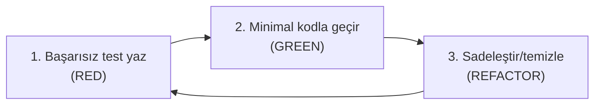

# 08 — Testler

Proje **TDD** (önce test, sonra kod) yaklaşımıyla geliştirilir. Bu rehber test
türlerini, nasıl çalıştırıldığını ve nasıl yazıldığını anlatır.

## Test Piramidi

| Tür | Nerede | Ne test eder | Hız |
| --- | --- | --- | --- |
| **Birim (backend)** | `backend/tests/IKPro.Tests.Unit` | Saf mantık (bordro hesabı, slug türetme) — DB yok | Çok hızlı |
| **Entegrasyon (backend)** | `backend/tests/IKPro.Tests.Integration` | Gerçek HTTP + gerçek DB üzerinden uçtan uca uç davranışı | Orta |
| **Birim (frontend)** | `frontend/src/**/*.test.tsx` | Bileşen davranışı (Vitest + React Testing Library) | Hızlı |

## Çalıştırma

```bash
# Backend — hepsi
cd backend && dotnet test

# Backend — tek bir grup (filtre)
dotnet test --filter "FullyQualifiedName~Tenancy"

# Frontend — hepsi
cd frontend && npm test -- --run

# Frontend — tek dosya
npx vitest run src/auth/LoginPage.test.tsx
```

> Backend entegrasyon testleri **çalışan bir MSSQL** ister; `IKProDb_Test`'i her
> koşuda sıfırlar.

## Entegrasyon Testi Altyapısı

- **`IKProApiFactory`** (`WebApplicationFactory<Program>`): API'yi bellek-içi ayağa
  kaldırır, test DB'sini sıfırlar, rate-limit'i etkisizleştirir, dosya deposunu izole eder.
- **`[Collection("api")]`**: Tüm entegrasyon test sınıfları aynı fabrikayı paylaşır
  ve sıralı koşar (paylaşılan DB'de yarış olmasın).
- **`TenancyTestBase`**: Ortak yardımcılar — kiracı provizyonu/aktivasyonu
  (`ProvisionAndActivateAsync`), kiracı-kapsamlı tohumlama (`SeedInTenantAsync`),
  authed istemci (`AuthedClientAsync`), davet kabul (`AcceptInviteAsync`).

Tipik bir entegrasyon testi:

```csharp
[Fact]
public async Task Departments_AreIsolatedBetweenTenants()
{
    var a = await ProvisionAndActivateAsync("Globex", adminEmail);
    await SeedInTenantAsync(a.TenantId, db => { db.Departments.Add(new Department { Name = "X" }); return Task.CompletedTask; });

    var admin = await AuthedClientAsync(adminEmail);
    var depts = await GetAsync<List<DepartmentDto>>(admin, "/api/departments");
    depts.Should().ContainSingle();   // yalnız kendi kiracısını görür
}
```

## TDD Döngüsü (nasıl yazıyoruz)



1. Önce beklenen davranışı bir testle yaz — çalıştır, **başarısız** olduğunu gör
   (test gerçekten bir şeyi kontrol ediyor mu doğrular).
2. Testi geçirecek en küçük kodu yaz.
3. Testler yeşilken kodu temizle.
4. Her mantıklı adımda commit.

## Kütüphaneler

- **Backend:** xUnit (test çatısı), FluentAssertions (okunur iddialar:
  `.Should().Be(...)`), `WebApplicationFactory` (entegrasyon).
- **Frontend:** Vitest (koşucu), React Testing Library (bileşen), `userEvent` (etkileşim).

## Tarih-Kırılgan Testlerden Kaçın

Sabit tarih (`"2026-07-15"`) yazan testler takvim ilerleyince kırılabilir. Zaman'a
bağlı bir davranışı test ederken tarihleri **bugüne göreli** üret (`DateTime.UtcNow`)
— bunu bir kez `LeavesTests`'te sabit tarihler kırıldığında öğrendik.

## Sonraki Adım

Öğrendiklerini birleştir: uçtan uca bir özellik ekle → [09 — Yeni Özellik Ekleme](09-yeni-ozellik-ekleme-adim-adim.md).
